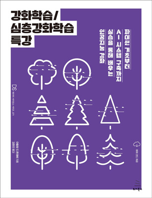

# 강화학습/심층강화학습 특강

[《강화학습/심층강화학습 특강》](https://wikibook.co.kr/rldrl/)(아들랑 드 폰테베 저/김정인 역) 실습 코드입니다.

**유데미 AI 최고 강사인 아들랑 드 폰테베가 선사하는 최상의 인공 지능 강의!**

아들랑 드 폰테베는 자신의 베스트셀러 동영상 교육을 통해 수십만 명의 사람들에게 AI 소프트웨어를 만드는 방법을 가르쳤다. 이제 최초로 그가 알려주는 실습 위주의 활기찬 교육 방식이 책으로 출간된다. 《강화학습/심층강화학습 특강》은 더 복잡한 공식과 표기법을 배우기 전에 기본부터 시작해서 강화학습과 딥러닝으로 AI 시스템을 구축할 때 필요한 모든 것을 알려준다. 완전하게 작동하는 5가지의 프로젝트를 통해 실질적인 내용을 습득해 나가며, 파이썬, 텐서플로, 케라스, 파이토치 같이 사용하기 쉬우면서도 널리 알려진 AI 프로그래밍 도구를 활용해 지능형 소프트웨어를 만드는 방법을 단계별로 보여준다. 《강화학습/심층강화학습 특강》은 모든 사람이 자신의 애플리케이션에서 작동할 AI를 구축하는 방법을 알려주는 최고의 가이드이다. 이 책을 읽고 난 후 상상력을 빼면 당신의 능력을 제한할 수 없다는 것을 알게 될 것이다.

## 이 책에서 다루는 내용

- 이전에 어떤 경험이 없더라도 AI 기초를 마스터한다.
- 가상의 자율 주행 자동차와 창고 로봇 등 재미있는 프로젝트를 구축한다.
- 실세계 비즈니스 문제를 해결하기 위해 AI를 사용한다.
- 파이썬으로 코딩하는 방법을 배운다.
- 강화학습의 5가지 원칙을 알아낸다.
- 자신만의 AI 도구를 만든다.

## 실습 파일 링크

- 03장: 파이썬 기초
    - [텍스트 표시하기](Chapter%2003/Displaying%20Text/displayingText.py)
    - [변수와 연산](Chapter%2003/Variables/variables.py)
    - [리스트와 배열](Chapter%2003/Lists%20and%20Arrays/listsAndArrays.py)
    - [if 문과 조건](Chapter%2003/If%20Statements/ifStatements.py)
    - [for와 while 루프](Chapter%2003/For%20and%20While%20Loops/forAndWhileLoops.py)
    - [함수](Chapter%2003/Functions/functions.py)
    - [클래스와 객체](Chapter%2003/Classes/classes.py)
- [04장: AI 기반 기술](Chapter%2004)
- [05장: 첫 AI 모델 만들기 - 슬롯머신 문제](Chapter%2005)
- [06장: 영업과 광고를 위한 AI](Chapter%2006)
- [07장: Q-러닝 기초](Chapter%2007)
- [08장: 물류를 위한 AI - 창고에서 일하는 로봇](Chapter%2008)
- [09장: 인공 두뇌로 프로가 되는 법 - 심층 Q-러닝](Chapter%2009)
- [10장: 자율주행차를 위한 AI](Chapter%2010)
- [11장: 심층 Q-러닝으로 데이터센터 냉난방 비용 최소화하기](Chapter%2011)
- [12장: 심층 합성곱 Q-러닝](Chapter%2012)
- [13장: 게임을 위한 AI - 스네이크 게임 마스터 되기](Chapter%2013)
- 부록: 연습문제 풀이
    - [텍스트 표시하기](Chapter%2003/Displaying%20Text/homework.py)
    - [변수와 연산](Chapter%2003/Variables/homework.py)
    - [리스트와 배열](Chapter%2003/Lists%20and%20Arrays/homework.py)
    - [if 문과 조건](Chapter%2003/If%20Statements/homework.py)
    - [for와 while 루프](Chapter%2003/For%20and%20While%20Loops/homework.py)
    - [함수](Chapter%2003/Functions/homework.py)
    - [클래스와 객체](Chapter%2003/Classes/homework.py)
